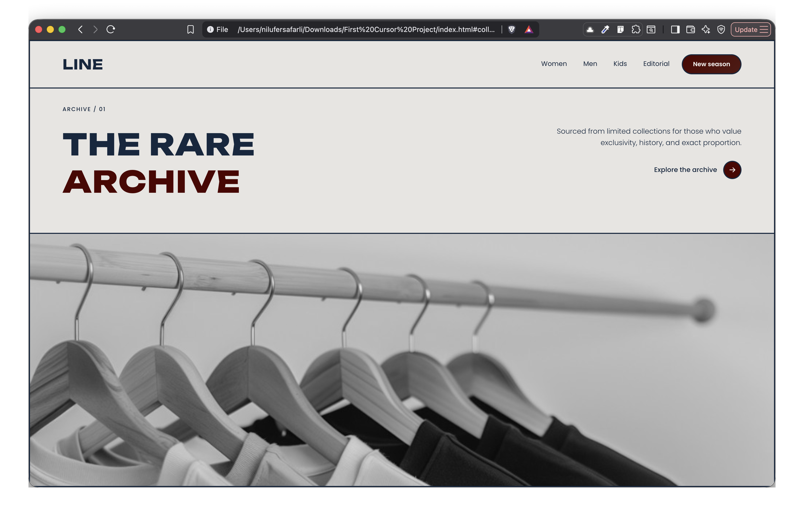
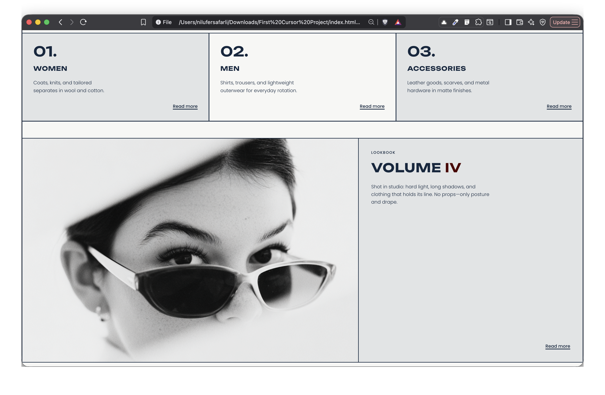
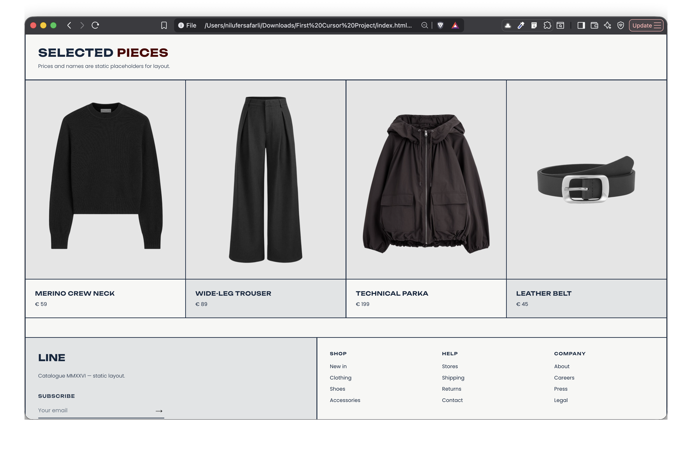

# LINE

**LINE** is a static visual study: a neobrutalist editorial surface for a rare-clothing archive. The idea is restraint with weight—thin structural lines, oversized type, and photography that reads like a spread, not a storefront. No motion for motion’s sake; the grid does the drama.

---

## Visuals

*Hero — archive framing, asymmetry, and a single photographic line.*

*Categories & lookbook — modular cells, borders as rhythm.*

*Selected pieces & footer — catalogue density, typographic hierarchy.*

---

## Design language

**Typography**

| Role | Family | Notes |
|------|--------|--------|
| Display & headings | **Unbounded** | Weights 500–800; anchors the logo and section titles. |
| Body & UI | **Poppins** | Weights 300–600; lede, navigation, and product copy. |

Both load from Google Fonts; system UI sans-serif is the fallback stack.

**Color palette** (exact values from the stylesheet)

| Token | Hex | Use |
|-------|-----|-----|
| Pearl | `#E9D4C3` | Warm accent in the raw palette |
| Blue-grey | `#8B9AA3` | Cool secondary accent |
| Navy | `#13273F` | Primary ink, borders, and structure |
| Inferno | `#4E0000` | Burgundy accent—headline splits, CTAs |
| Chocolate | `#5C4335` | Warm secondary accent |
| Canvas | `#F7F7F5` | Main background |

Semantic mixes (`color-mix`) build panels and muted text from these bases without drifting from the system.

---

## Architecture

Built with **semantic HTML5** and **CSS3** only: no framework, no build step. Layout relies on **flexbox** for vertical rhythm and stacking, and **CSS Grid** for the bento-style modules—borders align to a single grid so the page reads as one continuous composition rather than isolated blocks.

---

*Catalogue exploration — layout as argument.*